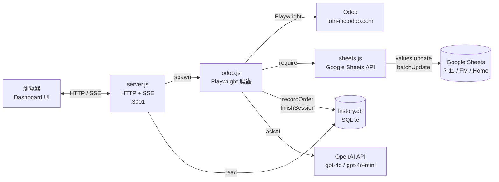
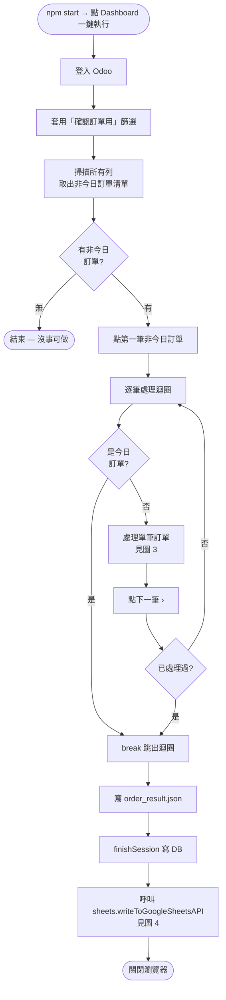
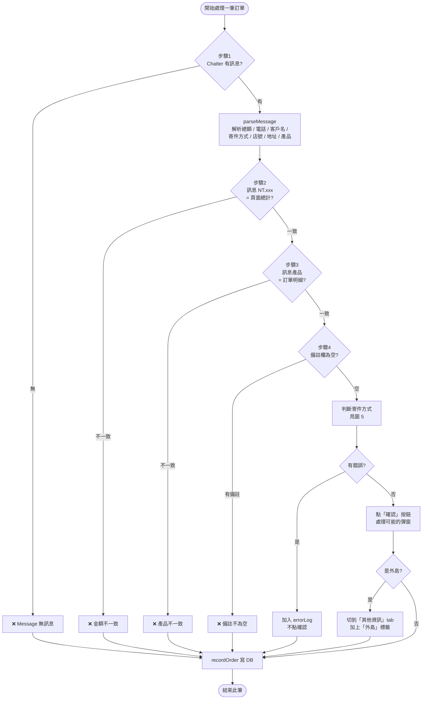
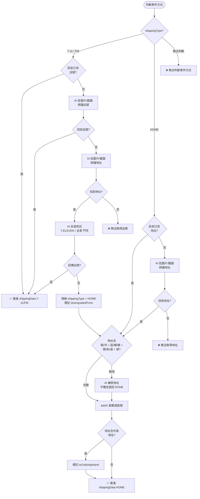
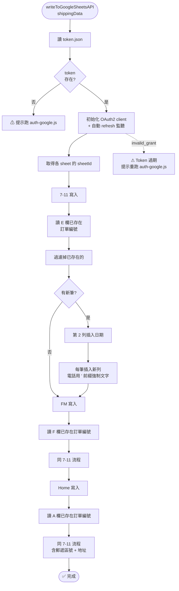
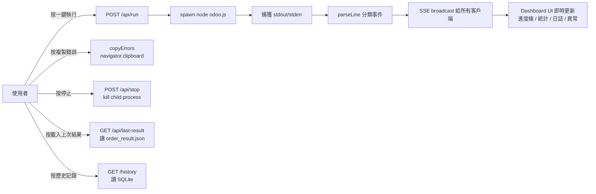
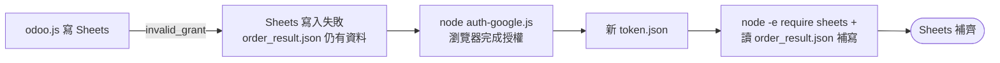

# 1.3.1 確認訂單 — 系統流程圖（Mermaid 版）

> 反映目前程式現狀（含 7-11/FM 地址反查與降級、地址補齊、Sheets 模組化、Dashboard 複製錯誤等改動）

---

## 1. 系統架構

---

## 2. 主流程（odoo.js）

---

## 3. 單筆訂單處理（核心邏輯）

---

## 4. 寄件方式判斷與 7-11/FM → HOME 降級

---

## 5. Google Sheets 寫入（sheets.js）

**注意事項：**
- 電話寫入時前綴 `'` → Sheets 視為純文字，不吃開頭的 0
- `+886`/`886` 開頭的會正規化成 `09********`
- 已存在的訂單編號會跳過，重跑安全
- 寫入日期 `writeDate` 在實際寫入時才取，跨午夜不會錯

---

## 6. Dashboard 控制流（server.js + dashboard.html）

---

## 7. 三條失敗路徑摘要

| 情境 | 處理 | 標記 |
|---|---|---|
| 7-11/FM 訊息直接給店號 | 直接寫入 7-11/FM 工作表 | — |
| 7-11/FM 給圖片可辨識店號 | AI 從圖片讀店號 → 寫入 | — |
| 7-11/FM 只給地址 → 反查到門市 | AI 反查店號 → 寫入 | — |
| 7-11/FM 只給地址 → 反查不到 | **降級為 HOME** → 寫入 Home 工作表 | `downgradedFrom: '7-11'/'FM'` |
| HOME 地址不完整 | AI 補齊縣市區路號 → 查郵遞區號 → 寫入 | `addressCompleted: true` |
| 訊息/訂單不一致（金額/產品/備註）| 不點確認 → 寫到 errors | DB 中 `status='error'` |

---

## 8. Token 失效復原

> 長期解：把 OAuth app 在 Google Cloud Console 從 Testing → In production，refresh token 就不會 7 天過期。
